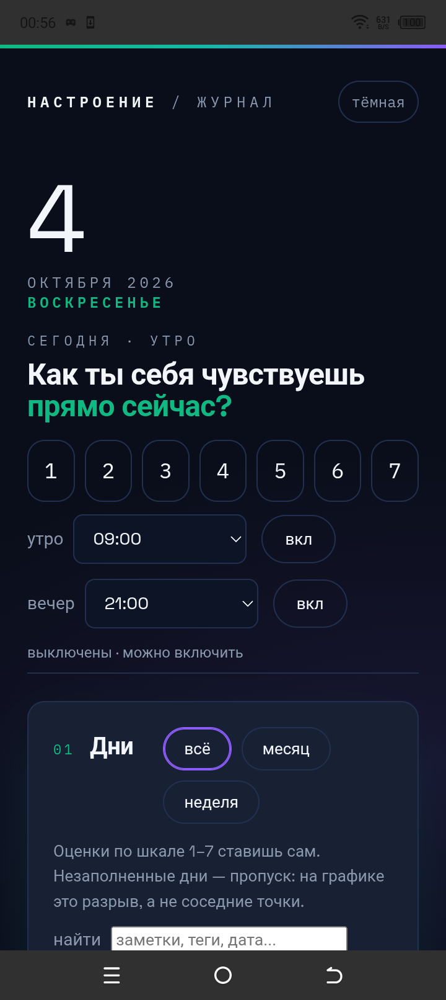
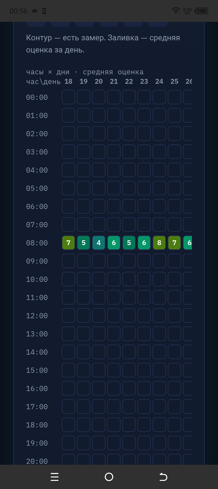
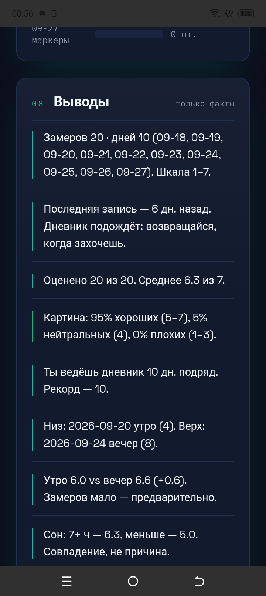

# Дневник настроения


Инструмент самонаблюдения: быстрая фиксация состояния (настроение и энергия 1–7, утро/день/вечер, сон, спорт, теги, заметка) с визуализацией и выводами человеческим языком.

**Это не медицинское изделие и не диагноз.** Дневник показывает факты и паттерны; интерпретация остаётся человеку и его специалисту.

## Скриншоты

| Главный экран | Теплокарта часы × дни | Выводы |
|:---:|:---:|:---:|
|  |  |  |

Скриншоты — с телефона TECNO BF7 (Android 12), приложение 0.1.

## Почему это нужно

Люди не помнят, что с ними было: память искажает, эмоции затмевают. Дневник — внешняя память: показывает 40% хороших дней, когда кажется, что «всегда плохо», и подсвечивает паттерны («по вторникам хуже»), которые в моменте не видны.

## Возможности (пре-альфа)

- Ввод за 15 секунд: один клик по быстрой цифре в hero, или полный замер (дата, слот, настроение/энергия 1–7, сон ч, спорт, теги, свой тег, заметка).
- Дни-карточки с оценкой прямо в карточке, заметками и метриками (объём, маркеры напряжения).
- Календарь сентября 2026 по ячейкам диапазона, график с календарной осью и разрывами на пропущенные дни, заливка-градиент, аннотации мин/макс.
- **Теплокарта «часы × дни»** — средняя оценка по часам за последние 31 день.
- Кольцевая диаграмма тегов (размер — частота, цвет — среднее настроение) + плашки статистики (замеры, дни, среднее, минимум/максимум, серия подряд).
- Выводы человеческим языком: картина в процентах, утро vs вечер, связи со сном и спортом после набора данных, серия дней ≤3 с мягким предупреждением, рекорд ведения без геймификации.
- Экспорт: JSON, CSV (с маркерами тревожности), PDF-сводка для специалиста (печать) — период, картина, частые теги, таблица. В приложении: шаринг файлов и текстовой сводки вместо печати, плюс импорт своих JSON/CSV с предпросмотром (0.2+).
- Напоминания: утро и вечер отдельно, отключаемые, настраиваемое время.
  На телефоне — нативные ежедневные уведомления (0.2+), в браузере —
  при открытой вкладке.
- Кастомизация оформления: тема (тёмная/светлая/авто), 3 палитры, 3 шрифта, плотность, радиус, тени, градиенты, анимации.

## Приватность

- Все данные — только в localStorage браузера/устройства. Никакого облака, регистрации, телеметрии.
- В приложении на телефоне данные живут в локальном хранилище приложения: удаление приложения или очистка его данных стирает историю — перед этим выгрузите JSON.
- Экспорт — только по действию пользователя.

## Запуск

ПК-версия — один файл без зависимостей и сборки:

```powershell
cd mood-diary-pc
python -m http.server 8080
# открыть http://localhost:8080/index.html
```

Google Fonts подтягиваются при наличии сети, иначе — системные шрифты.

## Android-приложение

Готовый подписанный APK лежит в разделе Releases (`Dnevnik-nastroeniya-0.1.apk`,
Android 7.0 и выше). Установка — разрешением «установка из неизвестных
источников», Google Play Services не нужны.

Подробности сборки, подписи и отличий телефонной версии от браузерной —
в [`mood-diary-android/README.md`](mood-diary-android/README.md), текст
релиза — в [`RELEASE_NOTES.md`](RELEASE_NOTES.md).

Проверено на TECNO BF7 (Android 12): установка, онбординг, быстрая оценка,
карточка дня, календарь, теплокарта, график, выводы, экспорт через
«Поделиться», сохранность данных после перезапуска.

## Структура

- `mood-diary-pc/index.html` — приложение (один файл).
- `mood-diary-android/` — та же логика в обёртке Capacitor для Android (см. `mood-diary-android/README.md`).

## Дорожная карта

- ~~Теплокарта «часы × дни»~~ ✅ готово
- ~~Android-приложение 0.1~~ ✅ готово (APK в Releases)
- ~~Напоминания на телефоне, импорт своих JSON/CSV~~ ✅ готово в 0.2
- Граф связей тегов — после накопления данных.
- Импорт из Daylio/CSV.
- RuStore.

## Статус

Пре-альфа. Выпущено приложение 0.1 для Android (см. Releases). Данные
держатся локально — при очистке хранилища история теряется.

## Лицензия

MIT — см. [LICENSE](LICENSE).