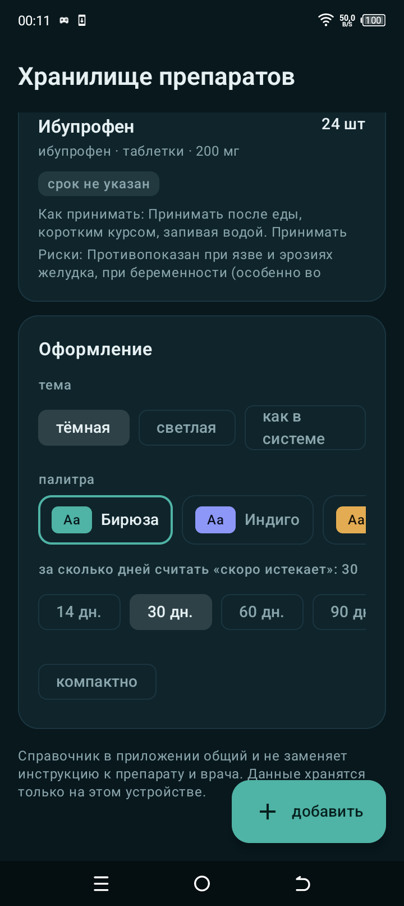
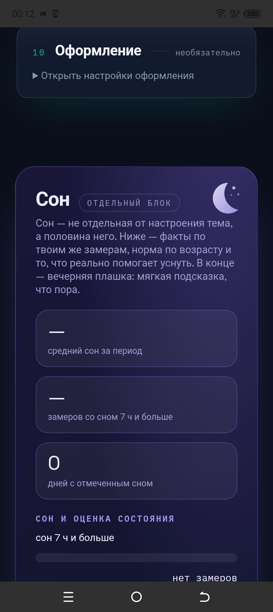

# Дневник настроения — Android

Веб-приложение из `../mood-diary-pc/index.html` завернуто в нативное
Android-приложение через Capacitor (WebView). Один код для ПК (браузер)
и телефона, поведение на телефоне проверено на устройстве.

## Снимки

| Главный экран | Блок «Сон» |
|---|---|
|  |  |

Снимки сделаны с телефона, а не в эмуляторе.

## Структура

- `www/index.html` — копия `../mood-diary-pc/index.html`, именно она
  попадает в APK. Источник правды — pc-файл: правится он, затем копируется
  сюда и выполняется `npx cap sync android`.
- `capacitor.config.json` — `appId: ru.mooddiary`, `webDir: www`.
- `android/` — сгенерированный нативный проект (`npx cap add android`),
  коммитится в репозиторий, кроме `build/` и `local.properties`.
- `mood-diary.jks` + `keystore.properties` — ключ подписи релиза и пароли.
  В репозиторий НЕ попадают (см. корневой `.gitignore`): иначе любой смог
  бы выпускать обновления от вашего имени. Храните копию ключа отдельно.

## Блок «Сон» и вечерняя плашка

Отдельный блок в конце страницы, вне нумерации 01–10 и вне основной
последовательности карточек: своя палитра (сумерки), своя рамка, свой значок.
Палитра блока не зависит от настроек оформления приложения — вечерний блок
одинаково выглядит и в изумрудной, и в другой теме.

В блоке: факты по собственным замерам (средний сон, доля ночей 7 ч и больше,
связь сна с оценкой состояния), норма по возрасту, правила укладывания,
признаки «уже пора» и настройка вечерней плашки.

Плашка — обычное системное уведомление, но на отдельном канале
`sleep-night` с важностью 4: именно она вылезает поверх окон. Что настроено:

- **свой звук.** `res/raw/night_chime.wav`, генерируется
  `python tools/make_chime.py res/raw`. Мягкий перезвон с медленной атакой и
  тихой амплитудой, а не системный сигнал: ночью системный будит.
- **без вибрации и без мигания.** Ночью это лишнее.
- **своя иконка.** `res/drawable/stat_sleep.xml` — белый силуэт полумесяца,
  Android красит его в `#8b7bd8`. Цветная иконка приложения в роли значка
  уведомления выглядит случайно.
- **короткая строка.** В плашке длинный текст обрезался многоточием: фраза
  про отбой идёт в `body`, подсказка — в `largeBody`.

Время срабатывания = отбой минус «предупредить за». Отбой после полуночи —
обычная дело, поэтому считается с переходом через сутки.

Кнопка «показать сейчас» ставит разовое уведомление через 20 секунд: иначе
включённую плашку можно проверить только следующим вечером.

### Две особенности этой прошивки

- **Платформа не знает `POST_NOTIFICATIONS`.** Телефон сообщает Android 12
  (API 31), но система на нём ещё без этого разрешения, и запрос падает с
  `Unknown permission`. Поэтому код не считает упавший запрос отказом: он
  пробует поставить уведомление — на этой прошивке уведомления разрешены.
  Точный ответ даёт планировщик, у него есть ошибка `NOTIFICATIONS_DISABLED`.
- **В беззвучном режиме всплывающая плашка не появляется** — это системное
  поведение, а не настройка приложения. На этой модели оно отключено по
  умолчанию.

Ещё одно ограничение плагина: `LocalNotificationManager.kt` намертво ставит
`VISIBILITY_PRIVATE`, поэтому на экране блокировки текст плашки не виден —
видно только имя приложения. Из JS это не обходится.

## Отличия телефонной версии от браузерной

В WebView нет части браузерных API, поэтому в приложении (`window.Capacitor`):

- кнопки JSON/CSV пишут файл во внутренний кэш и открывают системный диалог
  «Поделиться» (плагины `@capacitor/filesystem`, `@capacitor/share`);
- кнопка «PDF для психолога» вместо `window.print()` отправляет текстовую
  сводку отчёта через «Поделиться»;
- напоминания идут через `@capacitor/local-notifications` (ежедневные,
  переживают закрытие приложения; после перезагрузки восстанавливаются
  при первом открытии — на прошивках с запретом автозапуска приёмник
  системы не срабатывает);
- тёмные статус-бар и навигация заданы нативно в `styles.xml`
  (плагин `@capacitor/status-bar` — второй слой, на случай капризов прошивки).

В браузере поведение не меняется: там этот код не выполняется.

## Сборка

Нужны Node 20+, JDK 21 и Android SDK (платформа 36). Путь к SDK — в
`android/local.properties` (`sdk.dir=...`), файл локальный.

```powershell
# 1. Обновить витрину из исходника и синхронизировать
Copy-Item ..\mood-diary-pc\index.html .\www\index.html -Force
npx cap sync android

# 2. Debug APK для проверки на телефоне
$env:JAVA_HOME="<путь к JDK 21>"
.\android\gradlew.bat -p android :app:assembleDebug
# -> android/app/build/outputs/apk/debug/app-debug.apk

# 3. Подписанный релиз (нужны mood-diary.jks и keystore.properties рядом)
.\android\gradlew.bat -p android :app:assembleRelease
# -> android/app/build/outputs/apk/release/app-release.apk
```

APK подписан схемами v1+v2: часть прошивок не принимает пакеты только
с подписью v2.

## Совместимость

Android 7.0 и выше (minSdk 24 — минимум Capacitor 8), targetSdk 35.
Google Play Services не нужны. Проверено на TECNO BF7 (Android 12).
